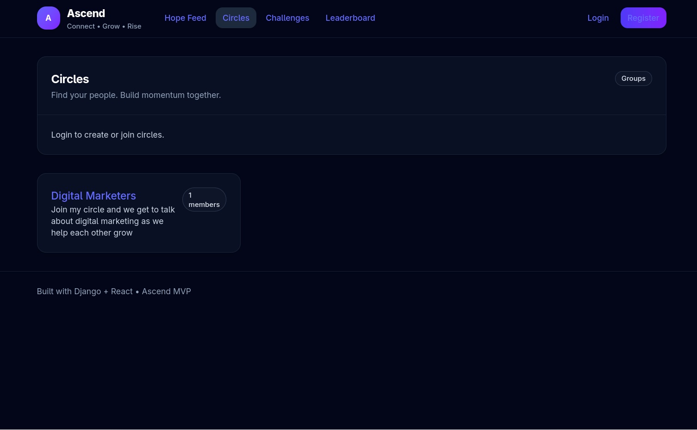
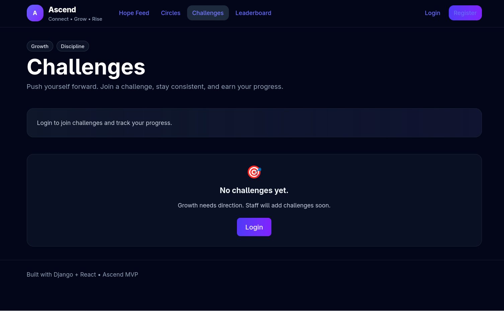

# Ascend Frontend 🚀

Frontend application for **Ascend**, a social growth platform designed to combine networking, motivation, and community engagement through structured interactions such as circles, challenges, and user-generated content.

This project focuses on delivering a **responsive, real-time, and product-oriented user experience**.

---

## 🚀 Overview

Ascend is built around the idea of **intentional interaction**, helping users connect, grow, and stay consistent through structured features.

The frontend integrates with a backend API to support:
- authentication flows
- community participation
- content-driven engagement
- real-time user interaction

---

## 🎬 Demo (Coming Soon)

  

> A walkthrough showing onboarding, navigation, and core product interactions.

---

## 📸 Screenshots

### 🔐 Authentication

  

---

### 🏠 Dashboard / Hope Feed

  

Users can share posts, track progress, and engage with community-driven content.

---

### 👥 Circles (Communities)

  

Users join circles to connect with like-minded individuals and participate in shared growth.

---

### 🏆 Challenges

  

Structured challenges encourage consistency, competition, and progress tracking.

---

### 👤 Profile

  

Profiles highlight goals, skills, and personal growth journey.

---

## 🧰 Tech Stack

- **Framework:** React (TypeScript)
- **Styling:** Tailwind CSS
- **Routing:** React Router
- **State Management:** Context API
- **API Integration:** Axios (REST APIs)
- **Build Tooling:** Vite

---

## 🔥 Key Features

- JWT-based authentication flows
- Onboarding experience for new users
- Community-driven circles
- Challenge-based engagement system
- Hope feed (user-generated content)
- Responsive UI (mobile & desktop)
- Modular and reusable component structure

---

## 🧠 Architecture Overview

- **Frontend:** React SPA (component-driven architecture)
- **Backend:** Django REST API
- **Data Flow:** Client → API → structured state updates
- **Design System:** Utility-first styling with Tailwind CSS

Built with **separation of concerns** to ensure scalability and maintainability.

---

## 📂 Project Structure
