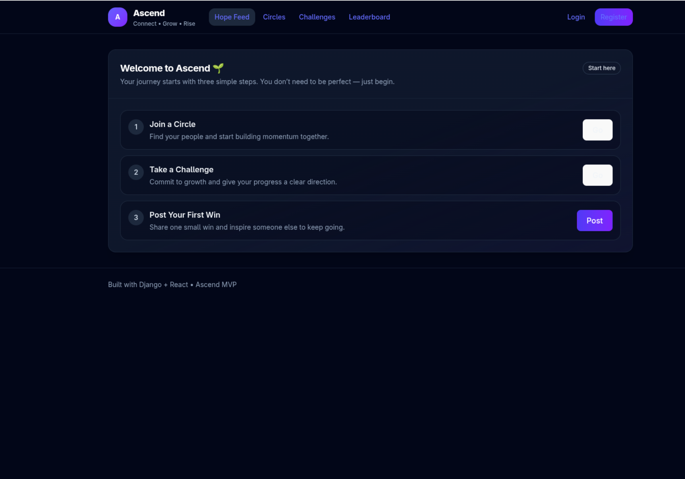

# Ascend Frontend

Ascend is a social growth platform designed to combine networking, motivation, and community engagement through structured interactions such as circles, challenges, and user-generated content.

This repository contains the **frontend application**, built to deliver a responsive, intuitive, and product-focused user experience.

---

## 🚀 Overview

The Ascend frontend is designed with a strong focus on usability, performance, and scalability. It connects to a backend API to provide real-time and interactive user experiences, including onboarding flows, community participation, and content-driven engagement.

---

## 📸 Screenshots

### 🔐 Authentication

  

---

### 🏠 Dashboard / Hope Feed

  

Users can share posts, track progress, and engage with community-driven content.

---

### 👥 Circles (Communities)

  

Users join circles to connect with like-minded individuals and participate in shared growth.

---

### 🏆 Challenges

  

Structured challenges encourage consistency, competition, and progress tracking.

---

### 👤 Profile

  

Profiles highlight goals, skills, and personal growth journey.

## 🧰 Tech Stack

- **Framework:** React (TypeScript)
- **Styling:** Tailwind CSS
- **State & Data Handling:** Context API / Axios
- **API Integration:** RESTful APIs
- **Routing:** React Router
- **Build Tooling:** Vite
- **Environment:** Linux-based development

---

## 🔥 Key Features

- User authentication (login, registration, session handling)
- Onboarding flows for new users
- Circles (community groups) and participation
- Challenge-based engagement system
- Hope feed (user-generated content)
- Responsive UI for mobile and desktop
- Clean and modular component structure

---

## 🧠 Architecture Overview

- **Frontend:** React SPA with modular components
- **Backend Integration:** Django REST API
- **Data Flow:** API-driven state with structured endpoints
- **Styling Approach:** Utility-first design with Tailwind CSS

The application is structured to support scalability, maintainability, and future feature expansion.

---

## 📂 Project Structure
